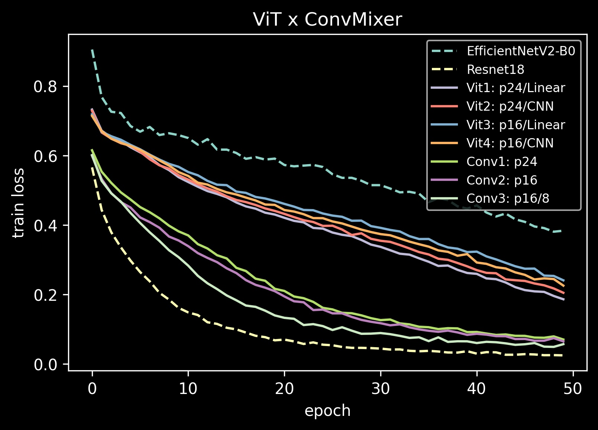
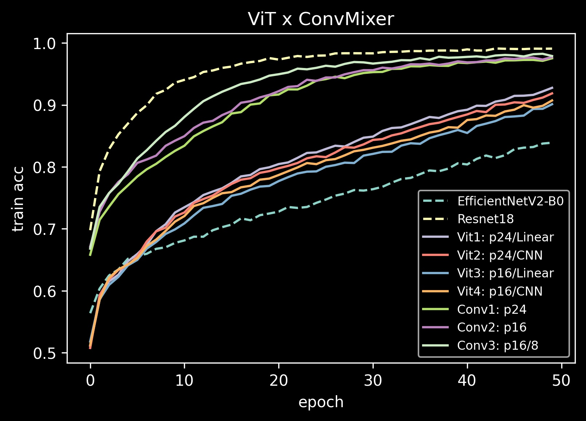

# Patches are all you need: Visual Transformers (ViT) x ConvMixer

Those experiments compare Vision Transformers (ViT) [An Image is Worth 16x16 Words: Transformers for Image Recognition at Scale](https://arxiv.org/pdf/2010.11929.pdf) and the new approach called ConvMixer proposed at [Patches Are All You Need](https://openreview.net/pdf?id=TVHS5Y4dNvM).

## Details about the experiments
- Dataset: [Dogs and Cats](https://www.kaggle.com/c/dogs-vs-cats/data), that contains 25000 images. All images are resized to 192x192.
- GPU: 8GB RTX 2080
- Optimizer: Adam 
- LR = 1e-4
- Loss: CrossEntropy
- FP16 precision
- Train Steps: 5000

All experiments were done using the same set of hyper-parameters, batch size, loss and optimizer. Maybe each model architecture would produce better results using specific optimizers, lr and lr scheduler.

## Results

- ViT 1 Linear: using a Linear layer to project the patches into 512 embed dim.
- ViT 2 CNN: using a CNN layer to extract patches and project into 512 embed dim.

| Model             | Batch Size    | Depth      | Kernel Size | Patch Size | GPU Memory  | Time per epoch
|--------------     |-------------- |----------- |-------------|----------- |------------ |--------------
| Resnet18          | 250           | -          | -           | -          | 4554MiB     |  20 sec
| EfficientNetV2-B0 | 250           | -          | -           | -          | 7790MiB     |  32 sec
| ViT 24 Linear     | 250           | 4          | -           | 24         | 3604MiB     |  17 sec
| ViT 24 CNN        | 250           | 4          | -           | 24         | 3612MiB     |  17 sec
| ConvMixer 24      | 250           | 4          | 9           | 24         | 2132MiB     |  11 sec
    
| Model             | Batch Size    | Depth      | Kernel Size | Patch Size | GPU Memory  | Time per epoch
|--------------     |-------------- |----------- |-------------|----------- |------------ |--------------
| ViT 16 Linar      | 250           | 4          | -           | 16         | 6768MiB     |  33 sec
| ViT 16 CNN        | 250           | 4          | -           | 16         | 6788MiB     |  34 sec
| ConvMixer 16      | 250           | 4          | 9           | 16         | 3150MiB     |  17 sec
| ConvMixer 16/8*   | 250           | 8          | 9           | 16         | 4612MiB     |  28 sec

*Version to match the size of Resnet 18 layers. The memory footprint is around the same, but take more time to train.

### Train Loss

### Train Acc

## Comments

Resnet18 and EfficientNetV2-B0 are used here as baselines.

ConvMixer8* was adjusted to match the model size of the baselines.

It can be seen that Visual Transformers takes more resources, and the resources increase with the reduction of the patch size which implies more patches. Images of 192x192 and patch size 24 implies 64 "tokens", i.e, sequence lenght of 64. With patch size 16, implies 144 "tokens".

ConvMixer extract the patches using a CNN layer, in the same way ViT CNN (ConvMixer do not flatten the tensor), and and then applies d copies of a simple fully-convolutional block consisting of large-kernel depthwise convolution followed by pointwise convolution.

## To-Do
- Apply to a more challenge dataset.
- Apply in higher resolution images.

## References
[ConvMixer](https://github.com/tmp-iclr/convmixer)

[Patches Are All You Need](https://openreview.net/pdf?id=TVHS5Y4dNvM)

[An Image is Worth 16x16 Words: Transformers for Image Recognition at Scale](https://arxiv.org/pdf/2010.11929.pdf)

[Mildlyoverfitted repository](https://github.com/jankrepl/mildlyoverfitted/tree/master/github_adventures/vision_transformer)

[Ross Wightman](https://github.com/rwightman/pytorch-image-models)